<h3><code>arta@github ~ $ ./contributions.sh</code></h3>

  

<h3><code>arta@github ~ $ whoami</code></h3>

 

<h3><code>arta@github ~ $ cat contact.txt</code></h3>

  
  
  
  
  

 

<code>contrib-heatmap.svg</code> is re-scraped and re-rendered every day by <a href="./.github/workflows/update-profile-art.yml">a GitHub Action</a>. Everything above is generated by <a href="./scripts">scripts in this repo</a> — no third-party stats service, nothing to rate-limit, nothing to 404.

  

<a href="./SETUP.md"><strong>Use this profile style →</strong></a>

